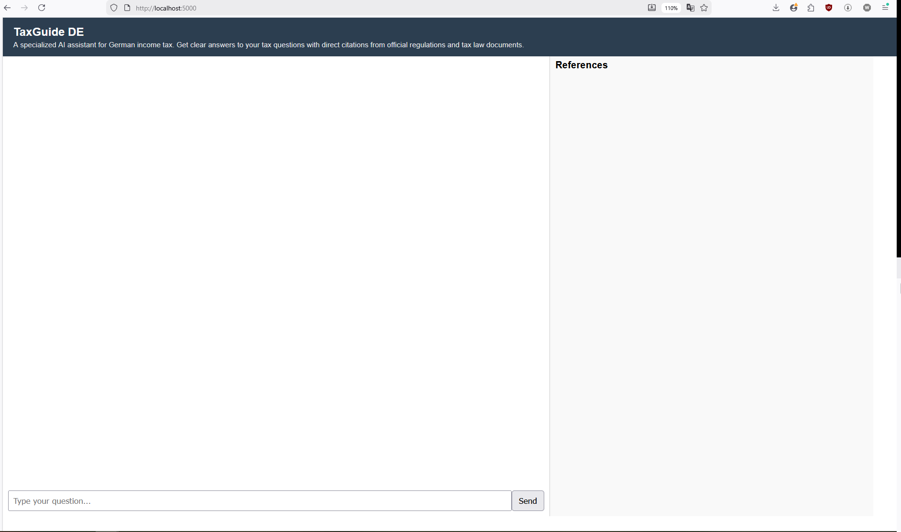
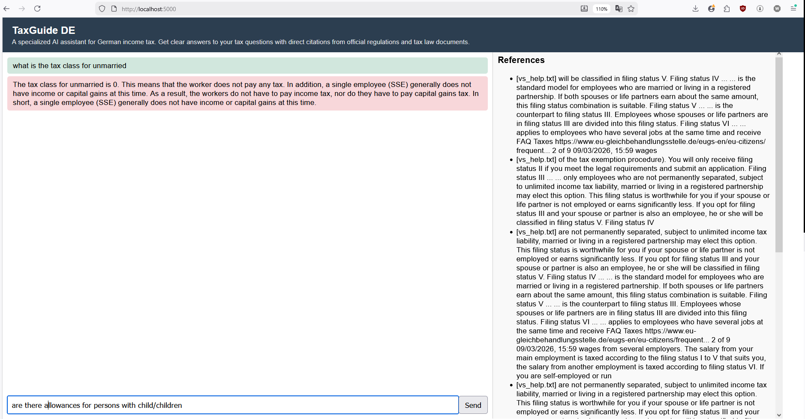
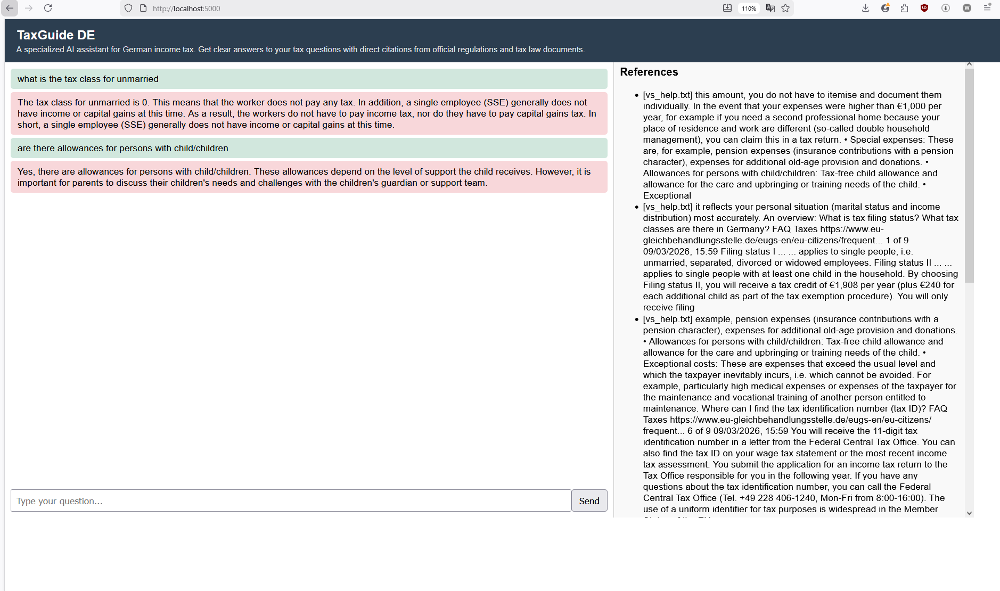

# TaxGuide DE

TaxGuide DE is a specialized AI assistant for **German income tax** that answers user questions using relevant sections from official tax regulations and law documents. It is built with a lightweight Retrieval-Augmented Generation (RAG) architecture that retrieves relevant document chunks and generates contextual responses with verifiable citations. The system is deployed locally using Kubernetes, demonstrating how modern LLM applications can be structured and operated without heavy cloud dependencies.

Focus areas of the project:
• **Microservice architecture** – separating the system into independent services (API, embedding service, vector store, and LLM inference) to improve modularity, maintainability, and scalability.
• **Containerized deployment** with Docker and **Kubernetes** – orchestrating multiple AI services and managing networking, service discovery, and persistent storage.
• **Lightweight LLM deployment** – running models locally using Ollama and a vector search pipeline powered by FAISS
• **Operational challenges of local AI systems** – addressing issues such as resource constraints, inter-service communication, and persistent storage management in a local Kubernetes environment.
---

# Memory usage
kubectl top pods
NAME                                        CPU(cores)   MEMORY(bytes)   
embedding-service-ff8bffc9f-76ppq           1m           392Mi           
flask-app-5f65674968-tz5l2                  2m           54Mi                      
ollama-55f9c7c5b-8skwf                      1m           526Mi           
vector-store-745b74754b-fzwt2               2m           76Mi   

## Project Overview

**TaxGuide DE** is a ultra light CPU-friendly RAG chatbot that combines:

* **LLM**: Ollama’s `qwen:0.5b`
* **Embeddings**: SentenceTransformer (`all-MiniLM-L6-v2`)
* **Vector Store**: FAISS
* **Web App/API**: Flask
* **Container Orchestration**: Kubernetes (Minikube)

It demonstrates **ML system design, microservice orchestration, and persistent storage handling** without needing high-end GPU hardware.

## Screenshots

 – the UI has two sections: on the left, a chat interface where users ask questions; on the right, the relevant sections of the tax document used to answer the question. This design ensures answers are traceable and verifiable.
 – example of a user submitting a question to the chatbot.
 – shows how answers include direct citations from official tax documents, making them verifiable.


## Architecture

[User Browser]
↓
[Flask API / UI Pod]
↓
[Vector Store Pod] ←→ [Embedding Service Pod]
↓
[LLM Pod (Ollama)]

* **Flask API / UI**: Accepts user queries and returns answers with relevant context.
* **Embedding Service**: Converts text into vector representations using MiniLM.
* **Vector Store (FAISS)**: Stores and retrieves text chunks based on embeddings.
* **LLM (Ollama)**: Generates answers using retrieved context.

All components are deployed on **Minikube** with PVC-backed persistent storage.

---

## Tech Stack

* **LLM**: Ollama qwen:0.5b
* **Embeddings**: SentenceTransformer (`all-MiniLM-L6-v2`)
* **Vector Store**: FAISS
* **Web/API**: Flask
* **Orchestration**: Kubernetes (Minikube)
* **Persistent Storage**: PVCs for FAISS index & Ollama model

---

##  Repository Structure
```tree
EdgeRAG/
├── embedding-service/
│   ├── app.py
│   ├── Dockerfile
│   └── requirements.txt
├── flask-app/
│   ├── app.py
│   ├── Dockerfile
│   ├── requirements.txt
│   └── templates/
│       └── index.html
├── llm-service/
├── vector-store/
│   ├── app.py
│   ├── Dockerfile
│   └── requirements.txt
├── images/
│   ├── TaxGuide_answer_with_reference.PNG
│   ├── TaxGuide_ask.PNG
│   └── TaxGuide_UI.PNG
├── k8s/
│   ├── embedding-service.yaml
│   ├── flask-app.yaml
│   ├── ollama-deployment.yaml
│   ├── ollama-pvc.yaml
│   ├── ollama-service.yaml
│   └── vector-store-service.yaml
├── LICENSE
├── vector_store_helper.py
└── vs_help.txt
```
---

##  Data Flow

1. **User Query** → Flask API
2. Flask calls **Embedding Service** → gets vector
3. Vector passed to **FAISS Vector Store** → top-k relevant chunks
4. Flask builds **RAG Prompt** → sends to Ollama LLM
5. **LLM generates answer** using retrieved context
6. Flask returns **answer + source chunks** to user

---

##  Usage

### Minikube Setup
Start Minikube with minikube start. 
Stop it with minikube stop. 
Check status with minikube status.

### Ollama Setup
Apply the PVC: kubectl apply -f k8s/ollama-pvc.yaml. 
Deploy the Ollama pod and service: kubectl apply -f k8s/ollama-deployment.yaml and kubectl apply -f k8s/ollama-service.yaml. 
Enter the Ollama pod with kubectl exec -it <ollama-pod-name> -- /bin/sh. 
Pull and run the model using ollama pull qwen:0.5b and ollama run qwen:0.5b. Exit the pod with /bye. 
To test, port-forward with kubectl port-forward pod/<ollama-pod-name> 11434:11434 and access the HTTP API using curl http://localhost:11434/v1/models or curl -X POST http://localhost:11434/v1/completions -H "Content-Type: application/json" -d '{"model":"qwen:0.5b","prompt":"Hello"}'.

### Embedding Service
Build the Docker image with docker build -t <docker-username>/embedding-service:latest embedding-service/. 
Deploy in Kubernetes with kubectl apply -f k8s/embedding-service.yaml. 
Test locally using docker run -p 5001:5001 <docker-username>/embedding-service:latest. 
Test the embedding endpoint using curl -X POST http://embedding-service:5001/embed -H "Content-Type: application/json" -d '{"text":"Hello World"}'.

### Vector Store
Build and push the image with docker build -t <docker-username>/vector-store:v4 vector-store/ and docker push <docker-username>/vector-store:v4. Deploy in Kubernetes using kubectl apply -f k8s/vector-store-service.yaml. 
Add documents using curl -X POST http://vector-store:5002/add -H "Content-Type: application/json" -d '{"text":"Hello World","category":"greeting","doc_id":"doc1"}' (repeat for other documents). 
Search documents with curl -X POST http://vector-store:5002/search -H "Content-Type: application/json" -d '{"text":"Hello","k":2}'. 
For easier testing, port-forward with kubectl port-forward deployment/vector-store 5002:5002 and use http://localhost:5002/search.

### Flask App / Chatbot
Build and push Docker image with docker build -t <docker-username>/flask-app:v4 flask-app/ and docker push <docker-username>/flask-app:v4. 
Deployment spec should reference the pushed image and expose port 5000. 
Test internally using curl -X POST http://flask-app:5000/chat -H "Content-Type: application/json" -d '{"question":"Hola"}'. 
For local testing, port-forward with kubectl port-forward deployment/flask-app 5000:5000 and call curl -X POST http://localhost:5000/chat -H "Content-Type: application/json" -d '{"question":"what is the tax class for unmarried"}'.

---

##  Highlights 

* Demonstrates **ML + Infra + Kubernetes orchestration**
* Shows handling of **stateful workloads** via PVC
* CPU-only RAG architecture suitable for **resource-constrained environments**
* Modular microservices: LLM, embeddings, vector store, Flask API

---


---

## References

* [FAISS](https://github.com/facebookresearch/faiss)
* [SentenceTransformers](https://www.sbert.net/)
* [Ollama](https://ollama.com/)
* [Kubernetes Docs](https://kubernetes.io/docs/)

---

#
